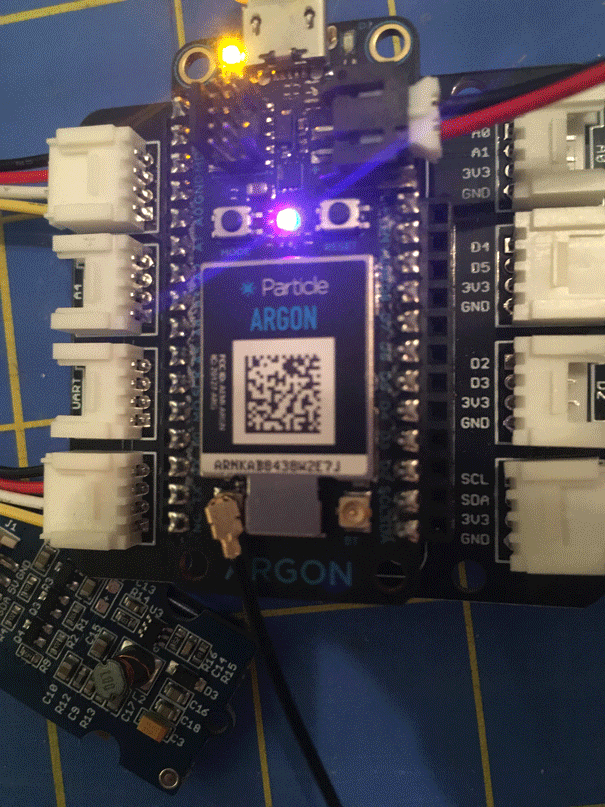

```{r setup, include=FALSE}
knitr::opts_chunk$set(echo = TRUE)
```

{width=300px}

## Welcome to the Ecological Sensors & Data course materials.
I've reorganized the webpage so I can add more material. If you came here looking for the tutorials on setting on the Particle air quality kit. Use the "Sensor Setup" link at the top of the page.

All of the code and other resources for the class (including how to build this website) are available as a repository on Github from the link on the menu bar.


