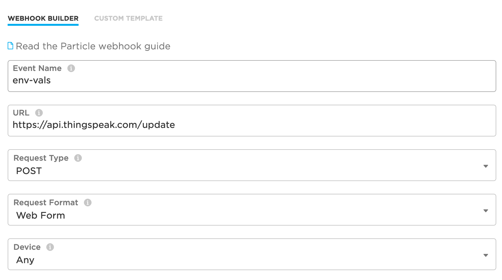

```{r setup, include=FALSE}
knitr::opts_chunk$set(echo = TRUE)
```

## Stuff to install first
* [A Particle account](https://login.particle.io/)
* The Particle mobile app for [iOS](https://apps.apple.com/us/app/particle-iot/id991459054) or [Android](https://play.google.com/store/apps/details?id=io.particle.android.app&hl=en_US)
* [Particle Workbench](https://particle.io/workbench)

**This tutorial is based on the [air quality kit tutorial available from Particle](https://docs.particle.io/quickstart/aqmk-project/).** I strongly recommend reading through that tutorial before you get started.

## Get started: assembling and pairing your device
**I've put together a Youtube video that will help you assemble your device:**
[](https://www.youtube.com/watch?v=aPB4ETfzj9M "Particle Assembly")

Great, so now you've put together your device it's time to program your device.

## Programming your Particle Argon microcontroller
Now that you have the device assembled and paired, you want to plug it into the computer using the USB cable that was supplied. Next open up the Particle Workbench (do this by opening Visual Studio Code -- commonly referred to as VS Code). When you've done that, you'll be ready to follow along with the tutorial in this next video. I recommend watching the video and then try it for yourself with the air quality kit tutorial and the video as reference.
[]( https://youtu.be/htxbdjW4TLk  "Particle Programming")

Okay, now that you've completed the work in this video, your sensor package is collecting data and sending those data to the cloud. The problem is that now we have to actually save our data to the cloud somewhere. That's the next exciting part.

## I tried to follow the tutorial and video, but I'm getting stuck
That's totally fine. I've included a working version of the code below. Watch this video and I'll explain how to get started very quickly using this code snippet.

**NOTE:** The point of this class is to learn how to use these devices in a functional matter. That means I suggest at least trying to work through the code as I describe above and is in the tutorial. That said, it is a little tricky and because we are working remotely it's not as easy to work through problems remotely. So if you give the above information a shot and it doesn't work, go ahead and use the script below, but do try to work through the material above -- I think you'll find it beneficial.

**Here's the video explaining how to load the code snippet below onto your Particle Argon:**
[]( https://youtu.be/yWhY9f3QVWo "Particle Quick Programming")


**Here's the code that you past into VS Code following the instructions in the video:**
```{c eval=FALSE}
/*
 * Project Argon_Tutorial
 * Description:
 * Author:
 * Date:
 */


#include "Air_Quality_Sensor.h"
#include "Adafruit_BME280.h"
#include "Adafruit_Sensor.h"
#include "SeeedOLED.h"
#include "JsonParserGeneratorRK.h"

#include "cayenne-particle/cayenne-particle.h"

#define CAYENNE_PRINT serial
#define DUST_SENSOR_PIN D4
#define SENSOR_READING_INTERVAL 900000
#define AQS_PIN A2

AirQualitySensor aqSensor(AQS_PIN);
Adafruit_BME280 bme;


unsigned long lastInterval;
unsigned long lowpulseoccupancy = 0;
unsigned long last_lpo = 0;
unsigned long duration;

float ratio = 0;
float concentration = 0;

const char * eventName =            "env-vals";    
const char * myWriteAPIKey = "ELEH3K8AQ2RNZ9AK";


float field1;  // initialized as 1.1 for demo only
float field2;  // initialized as 2.2 for demo only
float field3;
float field4;
float field5;
float field6;
float field7;
float field8;
char msg[256];       // Character array for the snprintf Publish Payload


// setup() runs once, when the device is first turned on.
void setup() {
   Serial.begin(9600);
   delay(5000);
   pinMode(BATT, INPUT);
   //Initialize OLED Screen
   Wire.begin();
   SeeedOled.init();

   SeeedOled.clearDisplay();
   SeeedOled.setNormalDisplay();
   SeeedOled.setPageMode();

   //OLED Startup Message
   SeeedOled.setTextXY(2, 0);
   SeeedOled.putString("Ready");
   SeeedOled.setTextXY(3, 0);
   SeeedOled.putString("to");
   SeeedOled.setTextXY(4, 0);
   SeeedOled.putString("Rock and Roll");

   pinMode(DUST_SENSOR_PIN, INPUT);
   lastInterval = millis();


   //checking to see if the air quality sensor is ready.
   if (aqSensor.init())
   {
      Serial.println("Air Quality Sensor ready.");
    }
   else
   {
      Serial.println("Air Quality Sensor ERROR!");
   }


   //checking to see if the BME sensor is ready.
   if (bme.begin())
   {
      Serial.println("BME280 Sensor ready.");
   }
   else
   {
      Serial.println("BME280 Sensor ERROR!");
   }


}


// loop() runs over and over again, as quickly as it can execute.
void loop() {
int temp, pressure, humidity;   
duration = pulseIn(DUST_SENSOR_PIN, LOW);
lowpulseoccupancy = lowpulseoccupancy + duration;
ratio = lowpulseoccupancy / (SENSOR_READING_INTERVAL * 10.0);
if ((millis() - lastInterval) > SENSOR_READING_INTERVAL)
{
   
   lastInterval = millis();

   float voltage = analogRead(BATT) * 0.0011224;
   //This is the air quality code
  
    temp = (float)bme.readTemperature();
    pressure = (float)(bme.readPressure() / 100.0F);
    humidity = (float)bme.readHumidity();
   //getBMEValues(temp, pressure, humidity);
   Serial.printlnf("Temp: %d", temp);
   Serial.printlnf("Pressure: %d", pressure);
   Serial.printlnf("Humidity: %d", humidity);
   updateDisplay(temp, humidity, pressure, ratio);
   //createEventPayload(temp, humidity, pressure, quality);
    field1 = temp;
    field2 = pressure;
    field3 = humidity;
    field4 = voltage;
    field5 = aqSensor.slope();
    field6 = aqSensor.getValue();
      if (lowpulseoccupancy > 0)
  {
    field7 = lowpulseoccupancy;
    field8 = ratio;
  }
    lowpulseoccupancy = 0;
    snprintf(msg, sizeof(msg),"{\"1\":\"%.2f\", \"2\":\"%.1f\", \"3\":\"%.2f\", \"4\":\"%.2f\", \"5\":\"%.3f\", \"6\":\"%.2f\", \"7\":\"%.1f\", \"8\":\"%.4f\", \"k\":\"%s\"}", field1, field2, field3, field4, field5, field6, field7, field8, myWriteAPIKey);
    Particle.publish(eventName, msg, PRIVATE, NO_ACK);

}

}


//function to run OLED display.
void updateDisplay(float temp, float humidity, float pressure, long ratio)
{
 SeeedOled.clearDisplay();

 SeeedOled.setTextXY(0, 3);
 SeeedOled.putNumber(ratio);

 SeeedOled.setTextXY(2, 0);
 SeeedOled.putString("Temp: ");
 SeeedOled.putNumber(temp);
 SeeedOled.putString("C");

 SeeedOled.setTextXY(3, 0);
 SeeedOled.putString("Humidity: ");
 SeeedOled.putNumber(humidity);
 SeeedOled.putString("%");

 SeeedOled.setTextXY(4, 0);
 SeeedOled.putString("Press: ");
 SeeedOled.putNumber(pressure);
 SeeedOled.putString(" hPa");

 if (concentration > 1)
 {
   SeeedOled.setTextXY(5, 0);
   SeeedOled.putString("Dust: ");
   SeeedOled.putNumber(concentration); // Cast our float to an int to make it more compact
   SeeedOled.putString(" pcs/L");
 }
}
```


&nbsp;  


## Configuring a webhook.
Now that your data are being streamed to the Particle's servers on the web, we need to tell the servers where we're going to store the data. We do this with a webhook that essentially reroutes our data.

To setup a webhook, go to [console.particle.io](http://console.particle.io) and login with the account you've created. On the left side of the webpage are a bunch of icons that have labels that pop up when you hover the mouse over them. Click on the one that says "integrations". When you do that you will see a page like the one below. Click on the box with the (+) labeled "New Integration":


From here, we are going to configure a webhook, so click on the box labeled webhook on the next page (as seen below).

Once you have clicked this button, you will see a webform like the one below. We will enter information about the Thingspeak server that will be receiving our data in this webform. This will tell the Particle servers how to forward the data collected on our sensors to the data dashboards we have setup on thingspeak.com.


You should fill out the form like you see below. The event name should be "env-vals", the url should be "https://api.thingspeak.com/update", the request type should be set to "POST", the request format should be set to "Web Form" and the device can be set to "Any" since we only have one device associated with our accounts. When you are done your form should look like the one below.


When you have entered that information click the link at the bottom of the page that says "Advanced Settings" that will reveal an additional menu at the bottom of the page. You want to add the rows just like you see in this image. The only exception is that you want to use the api_key I gave you rather than the api_key that is in the image below.


Once you are done your device should start automatically sending data to your thingspeak dashboard. Your thingspeak dashboard's website is linked to your channel ID. The channel ID for my dashboard is 1030130 so my dashboard is located at [https://thingspeak.com/channels/1030130](https://thingspeak.com/channels/1030130).
