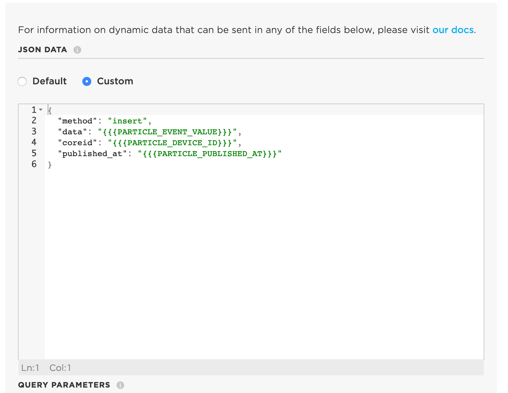

```{r setup, include=FALSE}
knitr::opts_chunk$set(echo = TRUE)
```

## Stuff to install first
* [A Particle account](https://login.particle.io/)
* The Particle mobile app for [iOS](https://apps.apple.com/us/app/particle-iot/id991459054) or [Android](https://play.google.com/store/apps/details?id=io.particle.android.app&hl=en_US)
* [Particle Workbench](https://particle.io/workbench)

**This tutorial is based on the [air quality kit tutorial available from Particle](https://docs.particle.io/quickstart/aqmk-project/).** I strongly recommend reading through that tutorial before you get started.

## Get started: assembling and pairing your device
**I've put together a Youtube video that will help you assemble your device:**
[](https://www.youtube.com/watch?v=aPB4ETfzj9M "Particle Assembly")

Great, so now you've put together your device it's time to program your device.

## Programming your Particle Argon microcontroller
Now that you have the device assembled and paired, you want to plug it into the computer using the USB cable that was supplied. Next open up the Particle Workbench (do this by opening Visual Studio Code -- commonly referred to as VS Code). When you've done that, you'll be ready to follow along with the tutorial in this next video. I recommend watching the video and then try it for yourself with the air quality kit tutorial and the video as reference.
[]( https://youtu.be/htxbdjW4TLk  "Particle Programming")

Okay, now that you've completed the work in this video, your sensor package is collecting data and sending those data to the cloud. The problem is that now we have to actually save our data to the cloud somewhere. That's the next exciting part.

## I tried to follow the tutorial and video, but I'm getting stuck
That's totally fine. I've included a working version of the code below. Watch this video and I'll explain how to get started very quickly using this code snippet.

**NOTE:** The point of this class is to learn how to use these devices in a functional matter. That means I suggest at least trying to work through the code as I describe above and is in the tutorial. That said, it is a little tricky and because we are working remotely it's not as easy to work through problems remotely. So if you give the above information a shot and it doesn't work, go ahead and use the script below, but do try to work through the material above -- I think you'll find it beneficial.

**Here's the video explaining how to load the code snippet below onto your Particle Argon:**
[]( https://youtu.be/yWhY9f3QVWo "Particle Quick Programming")


**Here's the code that you past into VS Code following the instructions in the video:**
```{c eval=FALSE}
/*
 * Air Quality Kit for FNR498
 * Setup sensor and connect to MyGeoHub
 * 
 * 
 */
#include "Particle.h"

SYSTEM_THREAD(ENABLED);

#include "Air_Quality_Sensor.h"
#include "Adafruit_BME280.h"
#include "SeeedOLED.h"
#include "JsonParserGeneratorRK.h"

#define AQS_PIN A2
#define DUST_SENSOR_PIN D4
#define SENSOR_READING_INTERVAL 900000

AirQualitySensor aqSensor(AQS_PIN);
Adafruit_BME280 bme;

unsigned long lastInterval;
unsigned long lowpulseoccupancy = 0;
unsigned long last_lpo = 0;
unsigned long duration;

float ratio = 0;
float concentration = 0;

//Keep eventName the same, this helps the webhook forward your data.
//Change MySiteID to name your device.
const char * eventName =            "env-vals";    
const char * MySiteID = "South Oaklan Lafayette IN";


float field1;  
float field2;  
float field3;
float field4;
float field5;
float field6;
float field7;
float field8;
char msg[256];       // Character array for the snprintf Publish Payload


int getBMEValues(int &temp, int &humidity, int &pressure);
void getDustSensorReadings();
String getAirQuality();
void createEventPayload(int temp, int humidity, int pressure, String airQuality);
void updateDisplay(int temp, int humidity, int pressure, String airQuality);

void setup()
{
  Serial.begin(9600);
  delay(50);

  // Configure the dust sensor pin as an input
  pinMode(DUST_SENSOR_PIN, INPUT);

  if (aqSensor.init())
  {
    Serial.println("Air Quality Sensor ready.");
  }
  else
  {
    Serial.println("Air Quality Sensor ERROR!");
  }

  Wire.begin();
  SeeedOled.init();

  SeeedOled.clearDisplay();
  SeeedOled.setNormalDisplay();
  SeeedOled.setPageMode();

  SeeedOled.setTextXY(2, 0);
  SeeedOled.putString("FNR498");
  SeeedOled.setTextXY(3, 0);
  SeeedOled.putString("Sensors");
  SeeedOled.setTextXY(4, 0);
  SeeedOled.putString("Initializing");

  if (bme.begin())
  {
    Serial.println("BME280 Sensor ready.");
  }
  else
  {
    Serial.println("BME280 Sensor ERROR!");
  }

delay(5000);

  SeeedOled.setTextXY(5, 0);
  SeeedOled.putString("Warm-Up");
  

  lastInterval = millis();
}


void loop()
{
  int temp, pressure, humidity;

  duration = pulseIn(DUST_SENSOR_PIN, LOW);
  lowpulseoccupancy = lowpulseoccupancy + duration;

  if ((millis() - lastInterval) > SENSOR_READING_INTERVAL)
  {
    String quality = getAirQuality();
    int qual_int = getAirQualityNum();
    Serial.printlnf("Air Quality: %s", quality.c_str());

    getBMEValues(temp, pressure, humidity);
    Serial.printlnf("Temp: %d", temp);
    Serial.printlnf("Pressure: %d", pressure);
    Serial.printlnf("Humidity: %d", humidity);

    getDustSensorReadings();

    updateDisplay(temp, humidity, pressure, quality, qual_int);


    field1 = temp;
    field2 = pressure;
    field3 = humidity;
    field4 = aqSensor.slope();
    field5 = aqSensor.getValue();
      if (lowpulseoccupancy > 0)
  {
    field6 = lowpulseoccupancy;
    field7 = ratio;
  }
    lowpulseoccupancy = 0;
    snprintf(msg, sizeof(msg),"{\"temp\":\"%.2f\", \"pressure\":\"%.1f\", \"humidity\":\"%.2f\", \"aq_slope\":\"%.2f\", \"voc_level\":\"%.3f\", \"lowpulseoccupancy\":\"%.2f\", \"dust\":\"%.1f\", \"deviceid\":\"%s\"}", field1, field2, field3, field4, field5, field6, field7, MySiteID);
    Particle.publish(eventName, msg, PRIVATE, NO_ACK);


    lowpulseoccupancy = 0;
    lastInterval = millis();


    
  }
}


int getAirQualityNum()
{
  int qual_int = aqSensor.slope();
  return qual_int;
}

String getAirQuality()
{
  int quality = aqSensor.slope();
  String qual = "None";

  if (quality == AirQualitySensor::FORCE_SIGNAL)
  {
    qual = "Danger";
  }
  else if (quality == AirQualitySensor::HIGH_POLLUTION)
  {
    qual = "High Pollution";
  }
  else if (quality == AirQualitySensor::LOW_POLLUTION)
  {
    qual = "Low Pollution";
  }
  else if (quality == AirQualitySensor::FRESH_AIR)
  {
    qual = "Fresh Air";
  }

  return qual;
}

int getBMEValues(int &temp, int &pressure, int &humidity)
{
  temp = (int)bme.readTemperature();
  pressure = (int)(bme.readPressure() / 100.0F);
  humidity = (int)bme.readHumidity();

  return 1;
}

void getDustSensorReadings()
{
  // This particular dust sensor returns 0s often, so let's filter them out by making sure we only
  // capture and use non-zero LPO values for our calculations once we get a good reading.
  if (lowpulseoccupancy == 0)
  {
    lowpulseoccupancy = last_lpo;
  }
  else
  {
    last_lpo = lowpulseoccupancy;
  }

  ratio = lowpulseoccupancy / (SENSOR_READING_INTERVAL * 10.0);                   // Integer percentage 0=>100
  concentration = 1.1 * pow(ratio, 3) - 3.8 * pow(ratio, 2) + 520 * ratio + 0.62; // using spec sheet curve

  Serial.printlnf("LPO: %d", lowpulseoccupancy);
  Serial.printlnf("Ratio: %f%%", ratio);
  Serial.printlnf("Concentration: %f pcs/L", concentration);
}


void updateDisplay(int temp, int humidity, int pressure, String airQuality, int qual_int)
{
  SeeedOled.clearDisplay();

  SeeedOled.setTextXY(0, 3);
  SeeedOled.putString(airQuality);

  SeeedOled.setTextXY(1, 0);
  SeeedOled.putString("VOC Levels: ");
  SeeedOled.putNumber(qual_int);


  SeeedOled.setTextXY(2, 0);
  SeeedOled.putString("Temp: ");
  SeeedOled.putNumber(temp);
  SeeedOled.putString("C");

  SeeedOled.setTextXY(3, 0);
  SeeedOled.putString("Humidity: ");
  SeeedOled.putNumber(humidity);
  SeeedOled.putString("%");

  SeeedOled.setTextXY(4, 0);
  SeeedOled.putString("Press: ");
  SeeedOled.putNumber(pressure);
  SeeedOled.putString(" hPa");

  if (concentration > 1)
  {
    SeeedOled.setTextXY(5, 0);
    SeeedOled.putString("Dust: ");
    SeeedOled.putNumber(concentration); // Will cast our float to an int to make it more compact
    SeeedOled.putString(" pcs/L");
  }
}
```


&nbsp;  


## Configuring a webhook.
Now that your data are being streamed to the Particle's servers on the web, we need to tell the servers where we're going to store the data. We do this with a webhook that essentially reroutes our data.

To setup a webhook, go to [console.particle.io](http://console.particle.io) and login with the account you've created. On the left side of the webpage are a bunch of icons that have labels that pop up when you hover the mouse over them. Click on the one that says "integrations". When you do that you will see a page like the one below. Click on the box with the (+) labeled "New Integration":


From here, we are going to configure a webhook, so click on the box labeled webhook on the next page (as seen below).

Once you have clicked this button, you will see a webform like the one below. We will enter information about the GeoEDF server at MyGeoHub that will be receiving our data in this webform. This will tell the Particle servers how to forward the data collected on our sensors to the database hosted at [mygeohub.org](http://mygeohub.org).


You should fill out the form like you see below. The event name should be "env-vals", the url should be "http://149.165.157.202:4792/aqsensors/data", the request type should be set to "POST", the request format should be set to "JSON" and the device can be set to "Any" since we have a device ID parameter in the JSON object to keep track of each device. When you are done your form should look like the one below.


Now, click on *Advanced Settings*. Click the radio button under JSON that says "Custom" and then paste the following code into the resulting textbox. When you're done your page should look like the picture below.

```{c eval=FALSE}
{
  "method": "insert",
  "data": "{{{PARTICLE_EVENT_VALUE}}}",
  "coreid": "{{{PARTICLE_DEVICE_ID}}}",
  "published_at": "{{{PARTICLE_PUBLISHED_AT}}}"
}
```




Now you have one more thing to do. Scroll back to the top and select "CUSTOM TEMPLATE". From there you want to paste the following code into the text box labeled "Particle webhook template reference". When you are done and your page looks like below, you are ready to hit SAVE!

```{c eval=FALSE}
{
    "event": "env-vals",
    "url": "http://149.165.157.202:4792/aqsensors/data",
    "requestType": "POST",
    "noDefaults": true,
    "rejectUnauthorized": false,
    "json": {
        "method": "insert",
        "data": "{{{PARTICLE_EVENT_VALUE}}}",
        "coreid": "{{{PARTICLE_DEVICE_ID}}}",
        "published_at": "{{{PARTICLE_PUBLISHED_AT}}}"
    }
}
```

